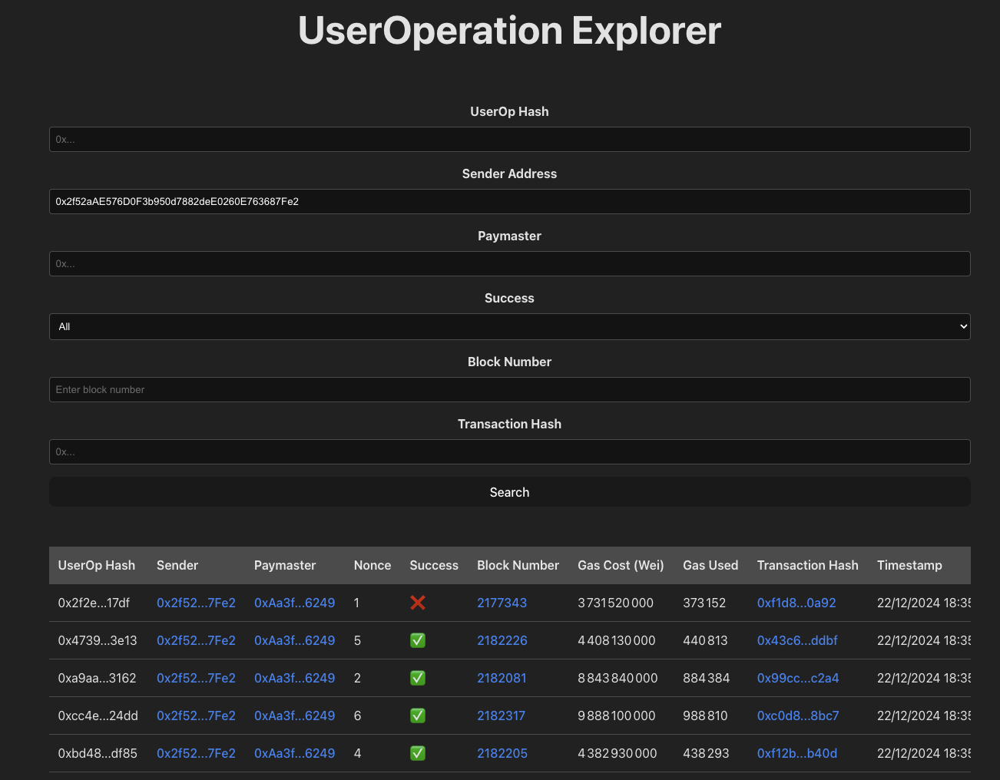

# UserOp Event Explorer

This is a user operation explorer for the Holesky Ethereum network.

Go to [backend](backend/README.md) to setup the server.

Go to [frontend](frontend/README.md) to setup the frontend.

