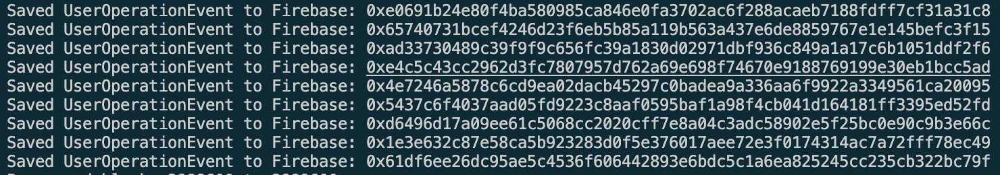
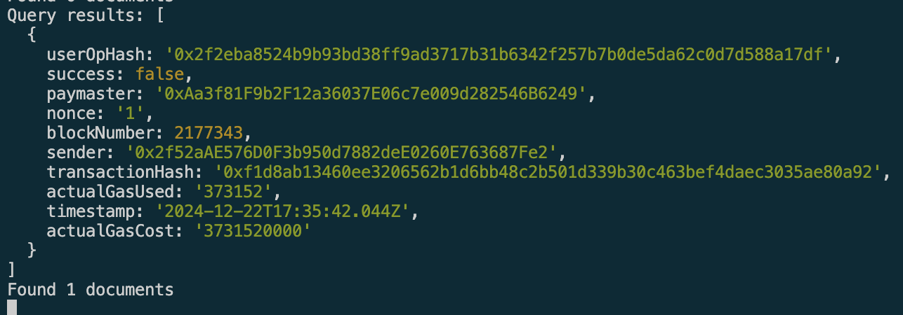

# Server Setup

```
cp .env.example .env
```

## Environment Variables

- `ETH_RPC_URL`: The URL of the Ethereum RPC node.
- `START_BLOCK`: The block number to start indexing from.
- `PORT`: The port to run the server on.
- `FIREBASE_API_KEY`: Firebase API key.
- `FIREBASE_AUTH_DOMAIN`: Firebase auth domain.
- `FIREBASE_PROJECT_ID`: Firebase project ID.
- `FIREBASE_STORAGE_BUCKET`: Firebase storage bucket.
- `FIREBASE_MESSAGING_SENDER_ID`: Firebase messaging sender ID.
- `FIREBASE_APP_ID`: Firebase app ID.

## Run Indexer

```
npm run dev
```



## Run API Server

```
npm run dev:api
```


